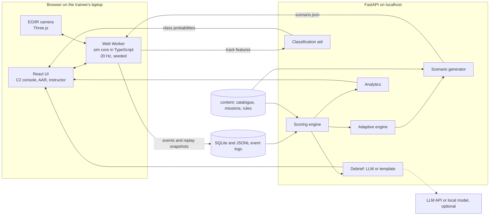
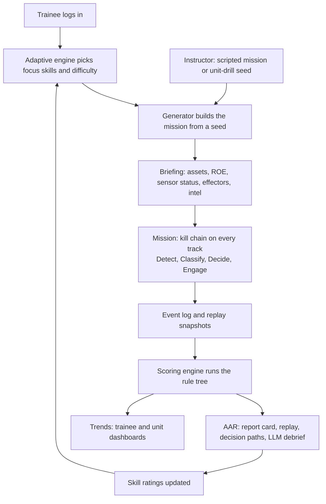
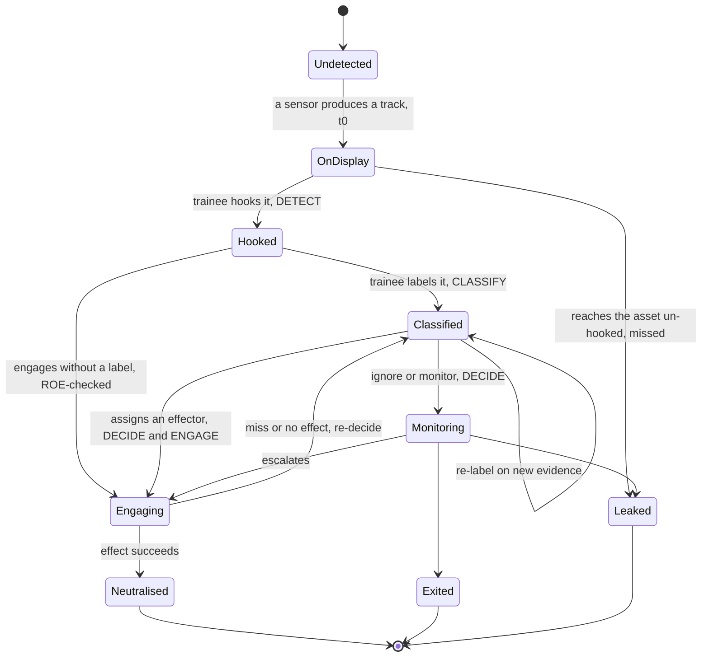
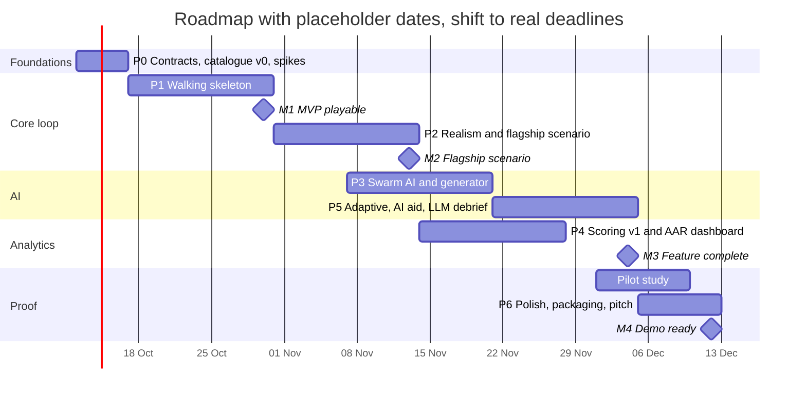

# PS 26247: AI Counter-Drone Decision Trainer: Plan, Workflow & Roadmap

> **Working title:** C-UAS Decision Trainer · **Plan version:** v1 (2026-10-09)
> **Source:** PS 26247, AI Drone & Counter-Drone Threat Simulation Trainer
> (Ministry of Defence / Defence Services Staff College, Software, Robotics & Drones).
> This folder is the seed of the project. It should move into its own repository
> once building starts (see Section 15).

## TL;DR

We're building a **counter-drone command-and-control (C2) training console that
runs in a browser**. It is not a shooting game. The trainee sits where a real
counter-drone operator sits: a tactical map fed by noisy radar, RF, EO/IR and
acoustic sensors, a camera they can slew, and a panel of Indian effectors (D4
jammer, spoofer and laser, Bhargavastra, L-70, ZU-23 and Shilka). Every drone
takes them through the kill chain, **Detect → Classify → Decide → Engage**, and
every step is:

- logged,
- scored by a rule tree that instructors can edit,
- replayed in an after-action review (AAR),
- summarised in plain language by an LLM debrief,
- and fed to an adaptive engine that builds the next mission around the trainee's weak spots.

It runs offline on an ordinary laptop. VR is an optional extra.

---

## 1. Understanding the problem

### 1.1 In one line

Officers need hundreds of repetitions of *deciding under pressure* which drone
is a threat and which counter-measure is worth its cost. Live drills can't
provide that: they are expensive, depend on the weather and are hard to repeat.
A simulator can.

### 1.2 The judges' checklist: what the PS asks, our answer, and how we prove it

| PS asks for | Our answer | Proof in the demo |
|---|---|---|
| Desktop or VR simulator on minimal hardware | Browser app (React + Three.js) served from `localhost`. Runs on a laptop with an integrated GPU. WebXR camera view is a P2 extra | Run it on the team's weakest laptop |
| Scripted scenarios | Hand-authored mission JSON, e.g. *night swarm on a forward airbase* | The flagship mission (Section 12) |
| Procedurally generated scenarios | Seeded generator picks terrain, time, weather, drone mix, numbers, approach axes and sensor failures. The same seed always produces the same mission | Generate 3 missions live, then re-run one seed |
| Decision-tree scoring | Rule tree in YAML. It scores every kill-chain step and explains every point it gives or takes | Jam a fiber-optic FPV and fire a missile at a ₹20k quadcopter, then show which rules fired |
| AAR dashboard | Replay timeline with hesitation markers and a decision path per track, plus trends per trainee and per unit | Replay and progress graph |
| Adaptive difficulty and randomisation | A rating per skill. The next mission targets the weakest skill at about 70% predicted success, and missions never repeat | "Next mission" built from the trainee's weakness profile |
| "AI-enabled" | Swarm AI, adaptive engine, noisy sensor models, a classification aid with calibrated confidence, and the LLM debrief (Section 7) | Each one is visible during the demo |

### 1.3 Users

- **Trainee:** a mid-career officer at DSSC. They decide which weapon to use, when, and under which rules of engagement (ROE). They are not only a gunner.
- **Instructor (directing staff):** writes missions, tunes the scoring rules, assigns unit drills and reads the AARs.
- **Course or unit commander:** reads trends across the whole unit.

### 1.4 The gap we fill

The existing trainers are Virtuix/LeadTech, Horizon Guardian, DroneShield
Operator XR and the UCF VRDT thesis. They focus on shooting, need a headset and
are foreign-built. Ours is built around decisions and the full kill chain. It
runs on a laptop, uses Indian equipment and terrain, gives unit-level analytics
and scores cost-exchange (the cost of the weapon used against the cost of the
drone it stopped).

---

## 2. Non-negotiables

1. **This is a decision trainer, not a shooter.** Aiming and trigger timing are never the skill being trained. Engaging means choosing an effector and a target, and the simulation resolves the outcome.
2. **Laptop-first and offline.** The core loop needs no internet. A cloud LLM is optional and always has a fallback.
3. **Public, labelled specs only.** Every number in `content/catalogue/` has a source column or is marked *illustrative*. No real base layouts.
4. **Scoring uses deterministic rules, not ML.** The same log scored with the same rules always gives the same score. Every point traces back to a rule ID and its message.
5. **Missions are reproducible.** A scenario is a JSON file plus a seed. The same seed gives every trainee in a unit the same mission.
6. **Degraded sensors are visible.** Sensor health is shown on screen and in the AAR, and the flagship scenario depends on it.
7. **AI advises and humans decide.** The classification aid is optional and shows its confidence. How the trainee uses it is itself scored (trust calibration).
8. **Everything is logged.** An append-only event log is the single source of truth for scoring, replay, analytics and the debrief.

---

## 3. Product concept

### 3.1 The trainee's screen (C2 console)

```
┌──────────────────────────────────────────────┬───────────────────────────┐
│ TACTICAL DISPLAY (map / PPI)                 │ EO/IR CAMERA   [EO|IR] 8x │
│  fused tracks: unknown / hostile / friendly  │  3D view, slews to the    │
│  sensor coverage arcs & blind sectors        │  hooked track (cueing)    │
│  defended assets, no-fire zones, corridors   ├───────────────────────────┤
│  bird flocks show up as tracks too           │ TRACK T-07                │
│                                              │ sensors: RADAR ✓ RF ✗ AC ✓│
│                                              │ 38 m/s · 60 m AGL · TTI 41s│
│                                              │ AI aid: FPV 71% (why?)    │
│                                              │ CLASSIFY  Bird Friendly   │
│                                              │   Recon FPV LoitMun Decoy │
├──────────────────────────────────────────────┤ DECIDE / ENGAGE           │
│ TRACK TABLE  id │ class │ rng │ TTI │ status  │ Ignore Monitor  RF-jam    │
│  sorted by time-to-impact (TTI)              │ GNSS-spoof Laser Rocket   │
│                                              │ Missile Gun  [ammo · ₹]   │
├──────────────────────────────────────────────┴───────────────────────────┤
│ ROE: WEAPONS TIGHT · RADAR ok · RF ⚠ no emitters · ACOUSTIC ⚠ high noise │
└──────────────────────────────────────────────────────────────────────────┘
```

The 2D tactical display is the main surface. 3D appears only in the EO/IR
camera window, which is where *classification* happens. This keeps the product
on decisions rather than shooting, and keeps it light enough for any laptop.

### 3.2 What's in the world

All values are **illustrative tiers**. The real numbers live in
`content/catalogue/*.yaml`, each with a public source, and are labelled
"illustrative" in the UI.

**Drones and clutter**

| Class | Cues | Control link | Navigation | Threat | Cost tier | What it teaches |
|---|---|---|---|---|---|---|
| Bird | slow, erratic, flapping, small radar cross-section, warm in IR | none | none | none | none | Radar false alarms and drone look-alikes |
| Friendly UAV | IFF reply, flies a known corridor | RF | GNSS | none | none | Avoiding fratricide, and jamming's side effects on our own drones |
| Civil/hobby drone (P1) | Wi-Fi-band RF, wanders | RF | GNSS | low | low | ROE: monitor it, don't kill it |
| Recon quadcopter | hovers or orbits at stand-off | RF | GNSS | medium (spots for strikes) | ~₹20k–2L | Radar filters out hovering targets; cost-exchange |
| FPV kamikaze (RF) | fast, low, terminal dive, analog video RF | RF | manual | high | low | Short time-to-impact, and jamming works |
| FPV fiber-optic | same as above but silent on RF | fiber | manual | high | low | Jamming is useless, so it needs a hard kill |
| Loitering munition (fixed-wing) | faster, loud engine, larger radar cross-section, pre-programmed | none | GNSS/INS | very high | medium | Silent on RF; detected by radar and acoustic; partly spoofable |
| Decoy | copies a striker's signatures | varies | GNSS | none | very low | Don't spend expensive effectors on it |

**Effectors** (D4 figures are as stated in the PS)

| Effector | Kill type | Limits | Cost per engagement |
|---|---|---|---|
| D4 RF jammer | soft | ~3 km. Covers a whole sector, so it **also jams friendly drones** in that sector | very low |
| D4 GNSS jam/spoof | soft | Weaker against drones with INS backup. Affects friendly GNSS too | very low |
| D4 laser | hard | ~1–1.25 km. Needs a dwell time on each target and handles one target at a time. Degraded by rain, fog and smoke | very low per shot |
| Bhargavastra micro-rockets | hard, area | Fires salvos from a limited magazine, then reloads. Built for swarms | medium |
| Bhargavastra micro-missiles | hard, guided | Few rounds | high |
| L-70 / ZU-23 / Shilka | hard | Short range, limited ammo, **collateral risk** near civilians | low–medium |
| Ignore / Monitor / Request authority | none | Requesting authority adds a delay | 0 |

**How well each effector works against each target** (tiers, tuned in `effect_matrix.yaml`; cost is handled separately by scoring)

| Target \ Effector | RF jam | GNSS spoof | Laser | Rockets | Missile | Gun |
|---|---|---|---|---|---|---|
| Recon quad | ✓ | ~ | ✓ | ✓ | ✓ | ✓ |
| FPV (RF) | ✓ | ✗ | ~ (fast, needs dwell) | ✓ | ✓ | ~ |
| FPV fiber-optic | ✗ | ✗ | ~ | ✓ | ✓ | ~ |
| Loitering munition | ✗ | ~ | ✓ | ✓ | ✓ | ~ |
| Decoy | depends on link | ✓ | ✓ | ✓ | ✓ | ✓ |
| Friendly UAV | **fratricide** | **fratricide** | **fratricide** | **fratricide** | **fratricide** | **fratricide** |

### 3.3 Rules of engagement

- **ROE states:** *weapons free* (engage any hostile), *weapons tight* (hard kill only on positively identified hostiles) and *weapons hold* (self-defence only, otherwise request authority, which adds a delay).
- **No-fire zones** (a town or a hospital) block guns and rockets over them.
- **Friendly corridors** and IFF replies.

This is what the PS means by "decide which weapon, when, and under what rules".

---

## 4. Architecture

### 4.1 Components



### 4.2 Stack, and why

| Layer | Choice | Why |
|---|---|---|
| UI | React + TypeScript + Vite, state in Zustand, charts in Recharts | Same React + Vite setup as `console/` in this repo; the dashboard is a natural fit |
| Tactical display | HTML Canvas 2D (PixiJS if it gets slow) | Draws 200+ tracks at 60 fps on an integrated GPU |
| EO/IR camera | Three.js via `@react-three/fiber`, with a custom thermal post-process shader | No install. WebXR becomes possible later |
| Sim core | Pure TypeScript package with a seeded PRNG and a fixed timestep. Runs in a Web Worker, and in Node for bots | Keeps the UI smooth, and the same code runs the bots |
| Backend | Python FastAPI + SQLModel + SQLite | Matches this repo's `src/api/`; Python suits the ML work |
| ML | scikit-learn (gradient-boosted trees, isotonic calibration) | Small, explainable, trains in minutes |
| LLM | `DebriefProvider` interface: Groq (as in `src/agent/`) or a local model, with a template fallback | Works on air-gapped deployments |
| Contracts | JSON Schema in `schemas/`, generated into TS types and Pydantic models | One source of truth across TS and Python |
| Packaging | FastAPI serves the built frontend: one command, offline (`docker compose up` as an alternative) | "A normal laptop must be enough" |

### 4.3 Key design calls

- **Browser over Unity.** It needs no install, runs on any laptop, can be demoed from a URL, and reuses the team's React skills. Unity only wins if someone on the team already ships Unity, and VR is optional anyway.
- **3D only in the camera window.** The C2 picture is 2D, as it is in real counter-drone systems. Classification is the hard visual task, and that's where the 3D effort goes.
- **The sim runs in the browser and scoring runs on the server.** The sim streams events. Scoring is a pure function of the event log plus the rules, so it is testable in Python and can **re-score past sessions** when rules change.
- **Replay plays back recorded snapshots** (4 Hz) and never re-runs the simulation. That makes it robust to floating-point drift and to version changes.
- **Separate PRNG streams for each subsystem** (spawn, sensor noise, Pk rolls, birds). Adding one bird doesn't change the noise anywhere else, so seeds stay meaningful.

### 4.4 What to reuse from Apex Assist (this repo)

| Apex Assist | Reused as |
|---|---|
| `src/api/` FastAPI + `console/` Vite/React | Same structure for `server/` + `web/` |
| `src/agent/` Groq client + `tests/fake_groq.py` | Debrief provider and its test double |
| `src/audit/log.py` append-only JSONL | Event log |
| `src/trust/calibrate.py` isotonic regression + ECE | Calibrating the classification aid's confidence |
| `src/eval/metrics.py` | Pattern for the AAR metrics module |
| Rule citations in `src/rules/` | Rule ID + message on every scoring hit |

---

## 5. Workflows

### 5.1 The training loop, end to end



### 5.2 One track through the kill chain



`t0` is the first moment the track appears on the trainee's display from any
sensor. If the trainee found the target in the camera first, `t0` is the moment
it became resolvable there. Detection latency is `t_hook − t0`. Measuring from
the drone's spawn instead would be unfair whenever the sensors physically
couldn't see it yet.

### 5.3 A 15-minute session

1. **Briefing (1 min):** mission, defended assets, ROE, sensor health, effector inventory, and intel, which may be wrong at higher difficulty.
2. **Mission (8–12 min):** live C2 console.
3. **Scoring (a few seconds):** the server scores the event log.
4. **AAR (3–5 min):** report card, then replay, then debrief, then "your next mission will target S3 (night classification)".

### 5.4 Instructor workflow

- Write a scripted mission (JSON form in P1, map editor in P2), or pick a seed for a **unit drill** so everyone flies the same mission.
- Edit `rules.yaml`, **preview it by re-scoring past sessions**, then publish it as version *v+1*. Old scores keep their rules version.
- Live inject (P1): take the radar down, add a wave, or flip the ROE mid-mission.
- Read the unit dashboard and assign drills that target the unit's weakest skills.

### 5.5 Data contracts

**Event log**: append-only, one JSON object per line:

```json
{"t": 132.4, "type": "classify", "track": "T-07", "actor": "trainee",
 "data": {"class": "recon_quad", "ai_suggestion": {"class": "fpv_rf", "p": 0.71}}}
```

Event types: `session_start`, `track_displayed`, `track_hooked`, `classify`,
`ai_suggestion`, `decision`, `engage_order`, `engage_result`, `sensor_state`,
`roe_change`, `camera_slew` (attention), `leaker`, `fratricide`, `session_end`.

**Track fact record**: derived from the log plus ground truth. This is the only
input to scoring:

```
track_id, true_class, control_link, nav, threat_value, t_displayed, t_hooked,
final_class, t_classified, ai_suggested, ai_correct, accepted_ai, decision,
effector, effector_cost, roe_state, over_no_fire_zone, tti_at_decision,
outcome (neutralised | leaked | exited | fratricide)
```

---

## 6. Module specs

Each module is listed as **what it is**, then the key details, then its ✅
acceptance criteria.

### 6.1 Content catalogue (`content/catalogue/`)
These are YAML files: `drones.yaml`, `sensors.yaml`, `effectors.yaml`,
`effect_matrix.yaml`, `costs.yaml`. Every numeric field has `source:` or
`illustrative: true`.
✅ Schema validation passes, and a CI check fails if a number has neither a source nor the illustrative flag.

### 6.2 Scenario schema and generator (`schemas/scenario.schema.json`, `server/generator/`)

```json
{
  "id": "gen-7f3a", "seed": 918273,
  "map": {"terrain": "generic_plains_airbase_01", "assets": [{"id": "RWY", "type": "runway", "value": 10}]},
  "environment": {"time": "02:30", "weather": "haze", "visibility_km": 3, "ambient_noise_db": 55},
  "roe": {"state": "weapons_tight", "no_fire_zones": ["town_south"], "friendly_corridors": ["C1"]},
  "sensors": [{"type": "radar", "pos": [0, 0], "events": [{"t": 240, "state": "down", "for_s": 60}]}],
  "effectors": [{"type": "d4_laser", "pos": [100, 50]}, {"type": "zu23", "ammo": 400}],
  "waves": [{"t": 30, "tactic": "decoy_first", "bearing_deg": 40,
             "units": [{"class": "decoy", "n": 6}, {"class": "fpv_fiber", "n": 4}]}],
  "clutter": {"bird_flocks": 3, "friendly_flights": 1},
  "difficulty": {"level": 0.62, "focus": ["S3", "S4"]}
}
```

The generator pipeline takes `(seed, difficulty vector, focus skills)` and then:

1. picks the map and defended assets,
2. sets time and weather,
3. sets up the sensor suite and its degradation events,
4. sets a threat budget,
5. builds waves from tactic templates,
6. adds clutter (birds, friendly and civil traffic),
7. sets the ROE,
8. **validates** the result: schema check, oracle solvability (6.15), and a fingerprint check that it isn't too close to the trainee's last 20 missions.

Scripted missions use the same schema, plus a `randomise:` block (timing
jitter, alternative bearings), so even scripted missions don't repeat exactly.
✅ The same seed produces a byte-identical scenario. 1,000 generated scenarios all validate in a headless run.

### 6.3 Simulation core (`sim/`)
- **Timestep and state:** fixed 50 ms step (20 Hz) with deterministic entity ordering. Separate PRNG streams for each subsystem.
- **Terrain:** line-of-sight checks against a heightmap.
- **Outputs:** ground truth, raw sensor detections, fused tracks, events, and 4 Hz snapshots for replay.
- **Runtimes:** a Web Worker in the browser, and Node for bots.

✅ 300 entities run in under 5 ms per tick on the team's weakest laptop.

### 6.4 Sensors, degradation and fusion (`sim/sensors/`)
- **Radar:** scans at 1 Hz. Probability of detection follows a sigmoid of the SNR, where SNR ∝ RCS / R⁴. Its weaknesses are modelled directly:
  - a Doppler/MTI filter drops targets whose radial velocity is below *v_min*, so hovering drones disappear;
  - birds create false tracks;
  - terrain masks targets;
  - range and bearing carry noise.
- **RF detector:** sees only emitters. One sensor gives a bearing; two or more give a position. The band hints at the class (analog 5.8 GHz video suggests an FPV). Fiber-optic and autonomous drones are **invisible** to it. Urban RF noise creates false emitters.
- **EO/IR camera:** rendered in 3D (6.6). A target is classifiable only once it covers at least N pixels, so the trainee has to cue or zoom.
- **Acoustic:** detection range depends on source level minus ambient noise. Gives a bearing only. Loud engines (loitering munitions) are easy to hear; a noisy area masks them.
- **Fusion:** gating plus nearest-neighbour association, an alpha-beta filter, and a track confidence built from the contributing sensors. Tracks coast and then drop.
- **Degradation events** come from the scenario file: radar down, RF jammed by the enemy, camera fogged.

✅ In the flagship scenario the RF panel shows nothing, and radar is the only early warning.

### 6.5 Enemy AI (`sim/adversary/`)
- **Steering:** boids (separation, alignment, cohesion), plus seeking the target, avoiding known air-defence zones, and terrain-following at low altitude.
- **Tactic templates** run as a state machine per swarm:
  1. *ingress* in formation,
  2. *split* into groups (k-means on approach bearing),
  3. *flank*, preferring the sensors' blind sectors,
  4. *decoys first*, arriving Δt early to draw fire and use up laser dwell time and ammo,
  5. *time-on-target* (synchronised arrival),
  6. a terminal dive for FPVs.
- **Reactions:**
  - RF drones, when jammed, fall back to their failsafe (return home, hover or land).
  - When a group member is destroyed, the group scatters and re-routes.
  - Recon drones orbit at stand-off, hovering to exploit radar's weakness, and cue the strikers.
- Difficulty controls how sophisticated the tactics are. An RL-trained swarm policy is a P2 stretch.

✅ Two runs with different seeds produce visibly different approaches. The *decoy-first* tactic measurably drains the trainee's effectors in the bot tests.

### 6.6 C2 console and EO/IR view (`web/`)
- **Console:** the layout in 3.1. Hotkeys for hooking, classifying and engaging. The track table is sorted by time-to-impact (TTI).
- **EO/IR scene:** heightmap terrain with low-poly models: quad, FPV, fixed-wing and a flapping bird.
  - *EO mode* is day colour, and turns near-black with noise at night.
  - *IR mode* uses a white-hot shader that maps each object's heat to grey, with blur, sensor noise and range-dependent blur.
  - *Weather* adds fog and rain that reduce contrast.
- **Camera control:** zoom from 30° down to 2° field of view. Clicking a track slews the camera to it (cueing). Manual slew by mouse, or gamepad in P1.
- **Logging:** camera direction and map viewport are logged so the AAR can show an **attention trail**.

✅ 60 fps tactical display with 100 tracks, and at least 30 fps in the camera, on an integrated GPU.

### 6.7 Engagement resolution (`sim/effectors/`)
- An engagement first checks range, line of sight, ammo, cooldown, ROE and no-fire zones. A blocked order is logged together with its reason.
- Outcomes come from the effect matrix, adjusted for range, weather and target speed. Lasers need dwell time; projectiles have time of flight.
- **Side effects:**
  - A jammer sector catches friendly drones inside it.
  - Guns over a no-fire zone log a collateral event.
  - GNSS spoofing affects friendly GNSS.

✅ Each cell of the effect matrix has a unit test.

### 6.8 Event log (`server/events/`)
Events are batched over HTTP and stored append-only as JSONL per session, with
an index in SQLite. Replay snapshots are stored next to them.
✅ A session can be fully reconstructed from its log and snapshots.

### 6.9 Scoring engine (`server/scoring/`, `content/scoring/rules.yaml`)

```yaml
version: 1
weights: { detect: 0.25, classify: 0.25, decide_engage: 0.50 }
grades: { A: 85, B: 70, C: 55, D: 40 }      # below D is F

detect:                       # PS: 4 s full, 15 s partial, missed zero
  full_if_latency_le_s: 4
  linear_to_s: 15             # 100 at 4 s down to 40 at 15 s
  late_floor: 20              # detected after 15 s
  missed: 0

classify:                     # penalty[true_class][called_as]; anything unlisted is -10
  bird:     { recon_quad: -5, fpv_rf: -5, fpv_fiber: -5 }     # false alarm, small penalty
  fpv_rf:   { bird: -40, friendly: -40 }                       # missed threat, big penalty
  fpv_fiber:{ bird: -40, friendly: -40 }
  friendly: { "*hostile": -60 }

decide_engage:                # evaluated top-down; every matching rule applies
  - id: FRATRICIDE
    when: { true_class: friendly, action_in: [rf_jam, gnss_spoof, laser, rocket, missile, gun] }
    then: { severity: critical, points: -100, cap_grade: F }
    msg: "Engaged a friendly UAV."
  - id: JAM_UNJAMMABLE
    when: { control_link_in: [fiber, autonomous], action: rf_jam }
    then: { points: -15, tag: wasted_action }
    msg: "RF jamming cannot affect a {control_link} drone."
  - id: POOR_COST_EXCHANGE
    when: { cost_ratio_gt: 20 }            # effector cost / threat value
    then: { points: -20, tag: cost_exchange }
    msg: "Spent {effector_cost} to stop a {threat_value} drone."
  - id: TIGHT_ROE_UNIDENTIFIED
    when: { roe: weapons_tight, action_class: hard_kill, final_class: unknown }
    then: { severity: major, points: -30, tag: roe }
  - id: GUN_OVER_NO_FIRE_ZONE
    when: { action: gun, over_no_fire_zone: true }
    then: { severity: major, points: -30, tag: collateral }
  - id: LEAKER
    when: { outcome: leaked, true_threat: true }
    then: { points: -50, tag: leaker }
```

- **Output:** stage scores, a grade, the cost-exchange ratio, leakers, critical failures, and a **decision path for each track**, with every rule hit and its message.
- **Rules are versioned.** Every score records the rules version it was computed with.
- **Editing:** instructors edit the YAML directly in P0, or through a form with a re-score preview in P1.

✅ Bot regression suite (6.15): each bot triggers exactly the rules it was built to trigger, and the oracle scores at least 95.

### 6.10 AAR dashboard (`web/aar/`)
- **Report card:** grade, the D/C/D-E stage scores, cost-exchange, leakers, critical failures and the top 3 lessons.
- **Replay:**
  - a map scrubber, with a toggle between *what you saw* and *ground truth*;
  - event markers;
  - **hesitation bands**, shown red wherever an un-hooked or undecided hostile closed below a TTI threshold;
  - the camera attention trail.
- **Decision-path cards,** for example: `Detect 3.1 s ✓ → Classified Recon (truth: FPV fiber) ✗ −40 → RF jam ✗ JAM_UNJAMMABLE −15 → Leaked −50`.
- **Trainee trends:**
  - benchmark score, normalised score and difficulty reached across sessions;
  - detection latency, classification accuracy and cost-exchange;
  - a weakness radar across S1–S8;
  - a **saturation curve**: accuracy against the number of tracks active at once;
  - breakdowns by condition: day/night, urban/open, swarm/single.
- **Unit view:**
  - a heatmap of trainees × skills;
  - unit averages;
  - fair comparisons on fixed-seed drills;
  - the most common errors across the unit.
- **Export:** PDF report card.

✅ Renders 10 trainees × 50 sessions without lag. Synthetic data is clearly labelled.

### 6.11 Adaptive difficulty (`server/adaptive/`)

**Skills tracked**

| ID | Skill |
|---|---|
| S1 | Detection in clutter |
| S2 | Classification by day |
| S3 | Classification at night, in weather, on IR |
| S4 | RF-silent threats (fiber-optic, autonomous) |
| S5 | Swarm saturation |
| S6 | Telling friendly and civil traffic apart; ROE discipline |
| S7 | Cost-exchange discipline |
| S8 | Operating with degraded sensors (cueing, fusion) |

**Difficulty knobs:** threat count, swarm size, number of waves and axes,
speed, fraction of RF-silent drones, fraction of decoys, bird and civil
density, sensor degradation and failures, ROE complexity, effector scarcity,
warning time (terrain masking).

**Model:** an Elo-style rating per skill. A mission's difficulty on skill *s*
is computed from its knobs. After each mission, every skill it exercised is
updated from the stage outcomes. Elo is simple, explainable and works with few
sessions.

**Choosing the next mission:**
- The focus skill is sampled in proportion to weakness, using a softmax with some exploration.
- Difficulty is set so that predicted success is about **70%**, in the "stretch zone".
- Every mission gets a new seed, and the fingerprint check rules out near-repeats.

**P0 fallback:** a simple ladder. Raise the knobs when the score is above 75%;
lower them when it's below 50%.
✅ A synthetic trainee with a planted weakness gets at least 50% of its missions focused on that skill within 3 sessions.

### 6.12 AI classification aid (`server/aid/`)
- **Features:**
  - speed mean and variance, altitude, climb rate, an RCS estimate;
  - RF emission and band, acoustic class, thermal intensity;
  - flight pattern (hover, orbit, straight, or the oscillation that suggests flapping);
  - IFF.
- **Model:** gradient-boosted trees trained on about 100k track windows from the headless sim across all conditions, with isotonic calibration. Accuracy *should* drop in degraded conditions; that is the point.
- **UI:** top class, confidence, and two reasons (e.g. "no RF emission", "41 m/s").
- **Instructor modes:** off, honest, or *unreliable*, where the aid is deliberately degraded to test automation bias.
- **Trust metrics:**
  - how often the trainee agrees when the AI is right;
  - how often they override it when it's wrong;
  - time to classify with and without the aid.

✅ ECE below 0.05 on held-out synthetic data. Trust metrics appear in the AAR.

### 6.13 LLM debrief (`server/debrief/`)
1. Collect the facts as JSON: scores, the top errors with timestamps and track IDs, trend changes against the last 5 sessions, and weakness tags.
2. Prompt the LLM to return a fixed JSON shape: `{summary, strengths[], mistakes[{track, t, what, why, better_action}], pattern, next_drill}`.
3. Run a **validator**: every number, track ID and timestamp in the output must exist in the facts.
4. If validation fails, or the machine is offline, generate a **template debrief** from the same facts.

Example output: *"You engaged too late in urban scenarios. 3 of 5 leakers came
from the north-east blind sector, where your camera spent only 4% of the
mission."*
✅ The validator passes at least 95% of debriefs. Tests use a fake provider, like `tests/fake_groq.py`.

### 6.14 Backend API and data model (`server/api/`)
- **Sessions:**
  - `POST /sessions` returns a scenario and a session ID. Modes: adaptive, assigned or scripted.
  - `POST /sessions/{id}/events`, `POST /sessions/{id}/end`.
  - `GET /sessions/{id}/score`, `/replay`, `/debrief`.
- **Generation and the aid:** `POST /scenarios/generate`, `GET /missions`, `POST /aid/classify`.
- **Rules:** `GET|PUT /rules` (versioned), `POST /rules/preview` (re-score sessions against draft rules).
- **Analytics:** `GET /trainees/{id}/trends`, `GET /units/{id}/dashboard`.
- **Tables:** `unit`, `trainee`, `scenario`, `session`, `track_fact`, `score`, `rule_hit`, `skill_rating`, `ruleset`. Event logs are stored as JSONL files.

### 6.15 Bots (`bots/`), which are headless and run on the same sim core
- **Oracle:** sees ground truth. It hooks every track at `t0`, classifies correctly, and picks the cheapest effective effector allowed by the ROE, ordered by TTI. It gives the maximum achievable score, which is used for **normalised scores** (trainee ÷ oracle) and for the generator's **solvability check**.
- **Baselines:** *missile-everything* (should trip the cost-exchange rule), *jam-everything* (should fail against fiber and autonomous drones), *trigger-happy* (should commit fratricide on missions with friendlies) and *passive* (should let leakers through). These are the scoring engine's regression tests.
- **Synthetic trainees:** a noisy oracle with skill parameters and a learning rate. Used to fill dashboards during development and to stress-test the adaptive engine. **Never presented as real data.**

---

## 7. Where the AI is

| AI component | Technique | Why it matters | Fallback |
|---|---|---|---|
| Enemy swarm behaviour | Boids plus tactic templates (split, flank, decoy-first, time-on-target, reactions to jamming) | Approaches emerge differently every run, so they can't be memorised | Scripted waypoints |
| Adaptive difficulty | Elo per skill, plus a generator that targets weaknesses at ~70% predicted success | A personal curriculum for each trainee | Difficulty ladder |
| Realistic sensors | Probabilistic models: detection vs. range and RCS, clutter, false tracks, IR noise and blur | Makes classification genuinely hard | none |
| Classification aid | Gradient-boosted classifier with calibrated confidence, plus trust metrics | Trains human–AI teaming and resistance to automation bias | Turned off |
| AI debrief | LLM over computed facts, with a validator | Coaching in plain language | Template |
| *Stretch:* RL adversary, CNN on rendered IR frames | PPO swarm policy; a small CNN | Further proof of depth | none |

---

## 8. Repository layout

```
counter-drone-trainer/
├── PLAN.md                  # this file
├── schemas/                 # JSON Schema: scenario, event, track_fact, rules, catalogue
├── content/
│   ├── catalogue/           # drones, sensors, effectors, effect_matrix, costs (with sources)
│   ├── missions/            # scripted missions, e.g. night_swarm_forward_airbase.json
│   └── scoring/rules.yaml   # versioned default rule tree
├── sim/                     # TypeScript sim core: entities, sensors, fusion, adversary, effectors
├── web/                     # React app: C2 console, EO/IR view, AAR, dashboards, instructor
├── server/                  # FastAPI: api, generator, scoring, adaptive, aid, debrief, analytics
├── bots/                    # oracle, baselines, synthetic trainees (Node, reusing sim/)
└── tests/                   # contract tests (TS↔Python), scoring regressions, generator determinism
```

---

## 9. Roadmap

### 9.1 Phases

| Phase | When | Goal | Deliverables | Exit criteria |
|---|---|---|---|---|
| **P0 Foundations** | Week 0 (4–5 days) | Lock the contracts and de-risk the tech | JSON Schemas; catalogue v0 with sources; console wireframe; tech spikes (IR shader, canvas with 200 tracks, seeded PRNG in a worker); repo and CI | Spikes run on the weakest laptop; the whole team has reviewed the schemas |
| **P1 Walking skeleton** | Weeks 1–2 | An ugly but complete loop | One scripted daytime mission; radar, RF and EO; bird, friendly, recon quad and RF FPV; RF jam, laser and gun; hook/classify/decide/engage; event log → backend → scoring v0 with all the PS example rules; a plain report card | A newcomer finishes a 5-minute mission and gets a report card; oracle ≥ 95; the missile-everything bot is penalised |
| **P2 Realism and flagship scenario** | Weeks 3–4 | Sensors and decisions that feel real | All 4 sensors with their weaknesses and degradation events; fusion and false tracks; full catalogue; all effectors and the effect matrix; ROE, no-fire zones and jamming side effects; EO/IR at night, on thermal and in weather; **the flagship mission** | Flagship mission playable end to end; the RF panel is visibly useless; cueing the IR camera from radar is the only winning path |
| **P3 Swarm AI and generator** | Weeks 4–5 | Missions that never repeat | Boids and tactic templates; seeded generator; `randomise` blocks for scripted missions; oracle solvability check; fingerprint check | Same seed gives the same bytes; 1,000 missions validate headless |
| **P4 Scoring v1 and AAR** | Weeks 5–6 | The report card that proves learning | Full rule tree, versioning, rules editor and re-score preview; replay (perceived vs. truth, hesitation bands, attention trail); decision-path cards; trainee trends; unit dashboard; PDF export | Every point traces back to a rule; the bot suite passes |
| **P5 Adaptive, AI aid and debrief** | Weeks 6–7 | The AI layer | Elo per skill and the weakness-targeting generator; classifier, calibration and trust metrics; LLM debrief with validator and template fallback | Adaptive, aid and debrief acceptance criteria met (6.11–6.13) |
| **P6 Proof, polish and pitch** | Weeks 8–9 | Win the room | Pilot study; performance pass; offline packaging; demo rehearsal; slide deck; P2 extras if there's time (WebXR, gamepad) | A real progress graph; the demo runs offline on the weakest laptop twice in a row |

### 9.2 Timeline

The dates below are placeholders starting Monday 12 Oct 2026. Shift them to
match the real hackathon deadlines.



### 9.3 Priority cut

- **P0, must have for any demo:**
  - **Core loop:** C2 console and EO/IR view; radar, RF and EO/IR sensors; catalogue (bird, friendly, recon quad, RF FPV, fiber FPV, loitering munition); RF jam, GNSS spoof, laser, rockets and gun.
  - **Scoring and review:** event log; scoring with all six PS example rules; replay and report card.
  - **Content and progression:** flagship mission; seeded generator; difficulty ladder; trainee trends and a basic unit view; LLM debrief with template fallback.
- **P1, should have:**
  - **Realism:** acoustic sensor; decoys; civil drones; ROE states and no-fire zones; jamming side effects.
  - **AI layer:** full swarm tactics; Elo per skill with weakness targeting; classification aid with trust metrics; oracle-normalised scores.
  - **Instructor tools:** rules editor with re-score preview; unit heatmap; PDF export; instructor live inject; gamepad.
- **P2, stretch:** WebXR camera view; RL adversary; CNN on IR frames; a human red cell flying the swarm; map editor; Hindi UI; integration with a learning management system.

### 9.4 If you only have 2–3 weeks

1. **Week 1:** P0 and the P1 skeleton in parallel.
2. **Week 2:** a reduced flagship mission (radar, RF and night IR; 5 drone classes; 4 effectors), scoring v0 with all six PS rules, and basic replay.
3. **Week 3:** generator with a difficulty ladder, trends graph, LLM debrief with template, a mini pilot (3 people × 5 sessions), and the pitch.

Cut: acoustic sensor, classification aid, unit heatmap, rules editor UI (edit
the YAML directly instead) and WebXR.

---

## 10. Team split (for a team of 6)

| Role | Owns | Busiest in |
|---|---|---|
| A: Sim engine (TS) | Sim core, sensors, fusion, engagement resolution | P1–P3 |
| B: 3D and EO/IR | Three.js camera, thermal shader, models, WebXR | P1–P2, P6 |
| C: Frontend | C2 console UI, AAR replay, dashboards | P1, P4 |
| D: Backend and scoring | FastAPI, database, event ingest, scoring engine, rules editor | P0–P1, P4 |
| E: AI/ML | Generator, swarm tactics, adaptive engine, classifier, debrief, bots | P3, P5 |
| F: Domain and proof | Catalogue and its sources, scripted missions, pilot study, pitch, QA | all phases |

With a smaller team, merge A+E, B+C and D+F.

---

## 11. Proving the trainer works

- **Benchmark mission:** a fixed seed that is never part of normal training rotation. Trainees fly it at sessions 1, 5 and 10. This is the **main evidence of learning** (the PS's "40% → 85%" graph).
- **Why raw scores aren't enough:** adaptive difficulty keeps raising the bar, so raw session scores plateau *by design*. Show the benchmark score, the oracle-normalised score and the difficulty level reached, and say this explicitly in the pitch.
- **Pilot study:** at least 5 people × 10 sessions of about 15 minutes, over about a week. Report N, the mean and the spread honestly. Use NCC cadets or defence aspirants if possible.
- **Engineering acceptance:**
  - performance budgets (6.3, 6.6);
  - generator determinism and solvability (6.2);
  - bot regression suite (6.15);
  - debrief validator pass rate (6.13);
  - aid calibration (6.12).
- Synthetic data is always labelled as synthetic. A progress graph is only shown if it comes from real people.

---

## 12. Demo script (about 7 minutes)

**Flagship mission: "Night autonomous swarm on a forward airbase."** RF
detection is useless because the drones are autonomous or on fiber-optic, so
the trainee has to cue the IR camera from radar. As the PS notes, this one
scenario demonstrates half the problem statement.

| Time | Beat |
|---|---|
| 0:00 | **Problem:** the Op Sindoor numbers and the cost-exchange lesson |
| 0:30 | **Briefing screen:** defended assets, ROE *weapons tight*, RF sensor healthy but showing no emitters |
| 1:00 | **Live play:** the RF panel stays empty; radar tracks the drones plus birds; the IR camera is cued for classification; laser and rockets engage. *Deliberately* jam a fiber-optic FPV and fire a missile at a cheap quad |
| 3:00 | **AAR:** report card; replay with a hesitation band; decision-path card showing `JAM_UNJAMMABLE` and `POOR_COST_EXCHANGE`; LLM debrief |
| 4:30 | **Progress:** benchmark graph from the pilot (real data only); unit heatmap |
| 5:15 | **Instructor:** edit a rule and preview the re-score; generate a new mission from a seed; show the adaptive engine saying "next mission targets S3" |
| 6:15 | **Recap:** the AI table (Section 7), offline laptop deployment, VR as an option |

---

## 13. Risks and mitigations

| Risk | Mitigation |
|---|---|
| The product drifts into a shooting game | C2 console comes first; there is no aiming mechanic; every feature is checked against non-negotiable 1 |
| 3D is too heavy for low-end laptops | 3D only in the camera window; low-poly models; quality presets; weekly test on the weakest laptop |
| Specs are unsourced or accidentally sensitive | Catalogue has a source column and "illustrative" labels; generic terrain; no real installation layouts |
| Scoring feels arbitrary | Every point cites a rule; the bot regression suite; instructors can edit the rules |
| The LLM hallucinates | Facts-only prompt, validator and template fallback |
| We can't prove learning | Benchmark mission; pilot study starts no later than week 8; synthetic data is labelled |
| Scope is too big | P0/P1/P2 cut; walking skeleton by the end of week 2; feature freeze before the pilot |
| The TS sim and Python backend drift apart | Contracts are written first, in P0; codegen; contract tests |
| Questions about air-gapped deployment | Offline-first; local LLM option; one-command run |

## 14. Anti-goals

- No aiming or trigger mechanics as a skill.
- No ML inside scoring.
- No headset requirement: VR is a view of the product, not the product.
- No claims of real-world accuracy or classified performance.
- No real military installation layouts.
- No networked multiplayer before P2.
- No cloud dependency in the core loop.
- No synthetic data shown as if it were real.

## 15. Open questions

1. **Deadlines:** what are the actual dates for idea submission, prototype and finale? The roadmap in Section 9 gets compressed to fit them.
2. **Team:** how many people, and with what skills? Anyone with Three.js, Unity or ML experience?
3. **Repository:** build in a new, dedicated repo (recommended) or here?
4. **LLM:** Groq, as in Apex Assist, or must everything run offline?
5. **Domain review:** do we have access to a mentor or officer who can sanity-check the ROE and effector logic?
