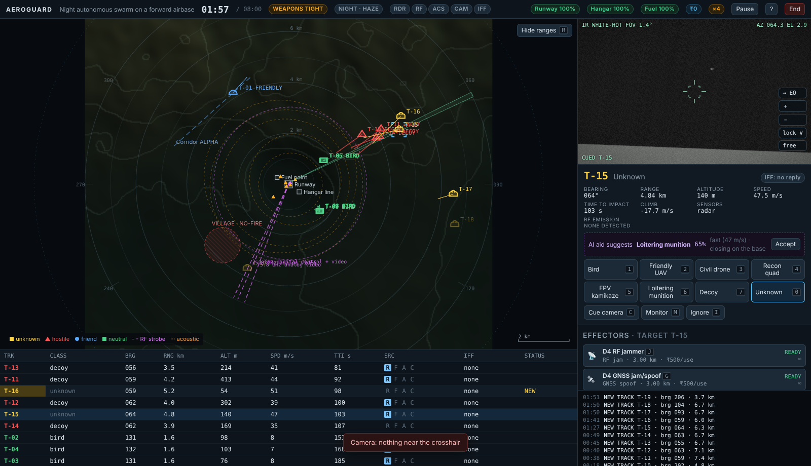
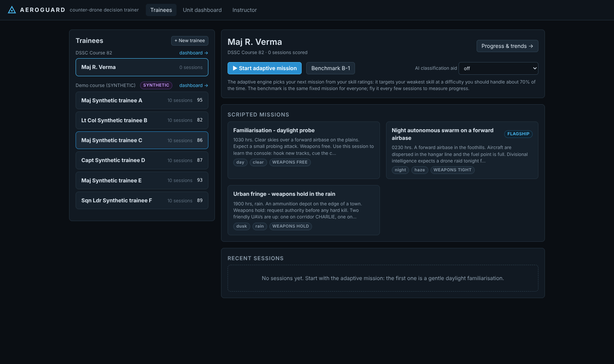
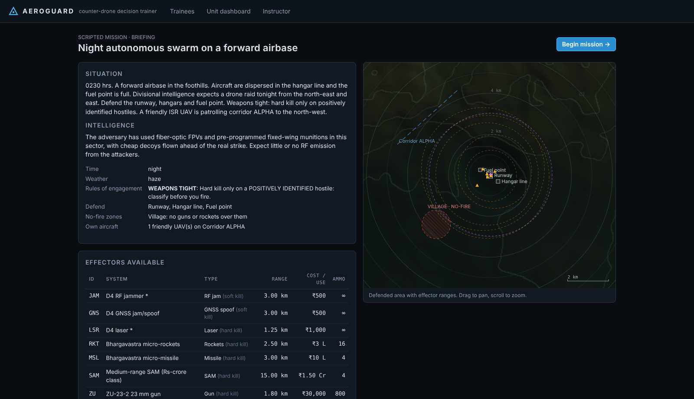
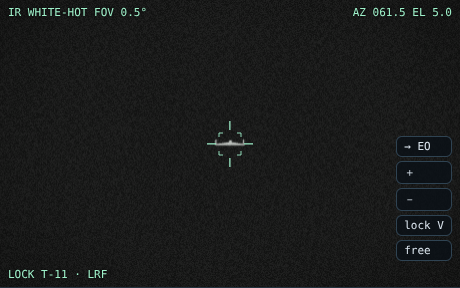
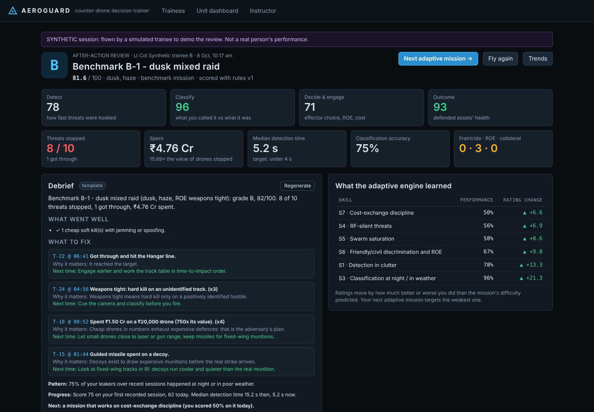
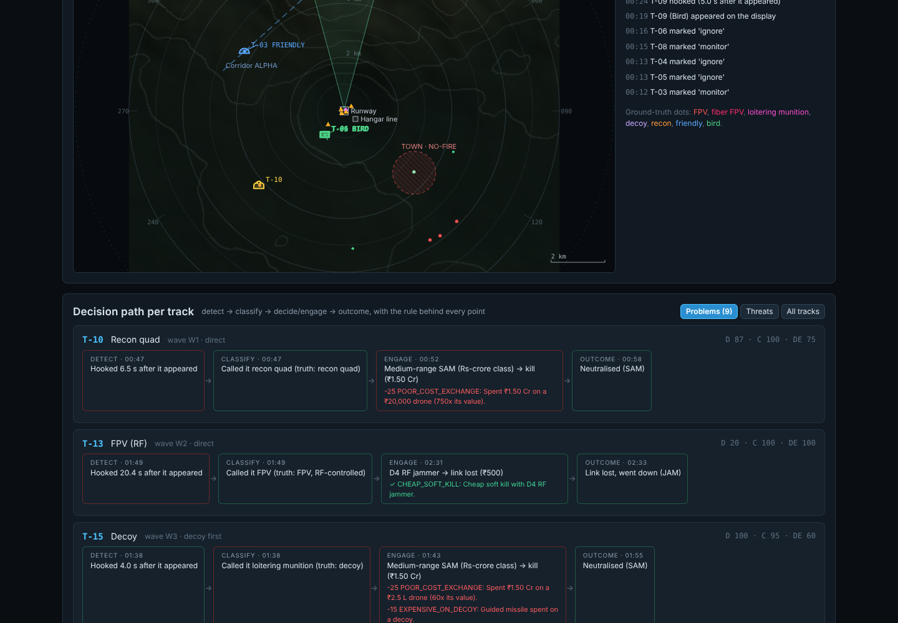
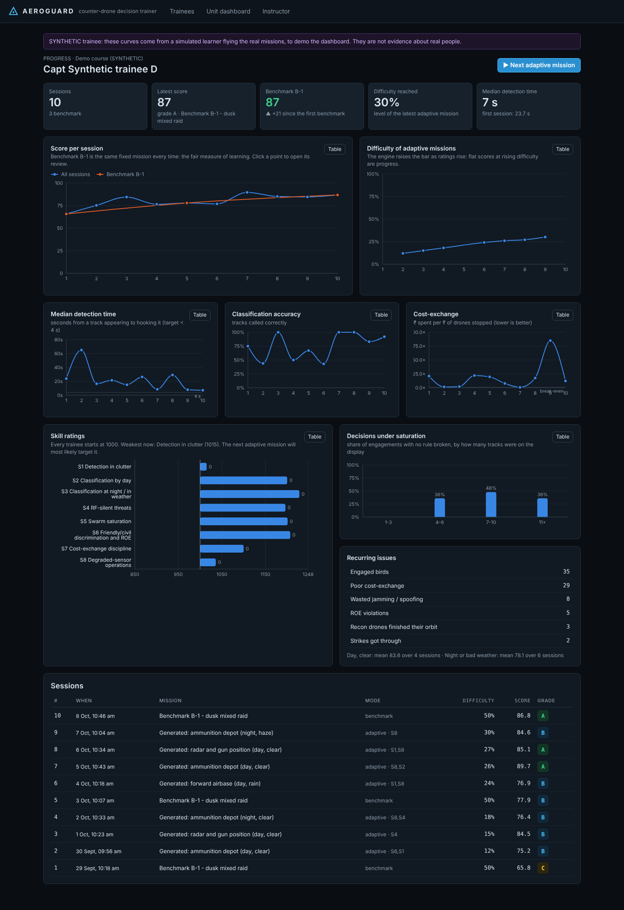
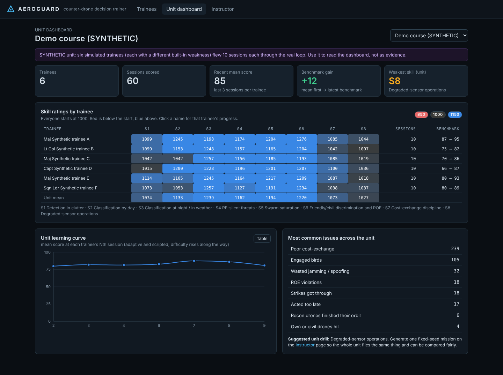
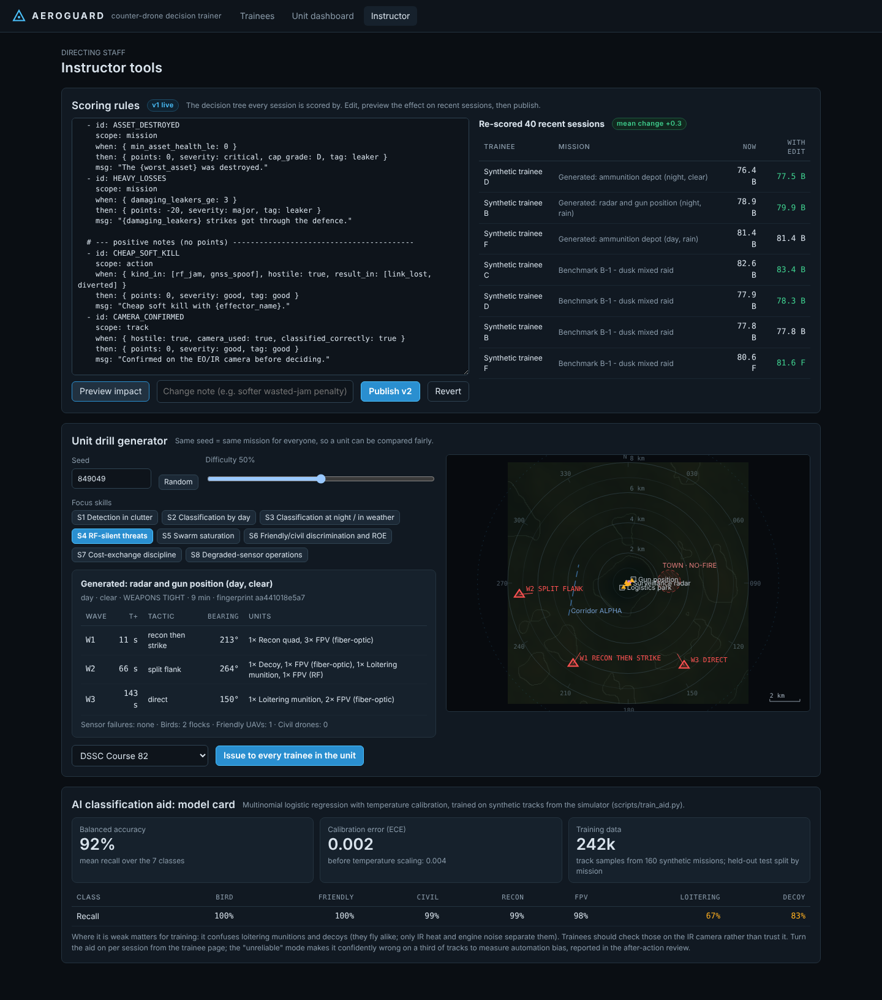
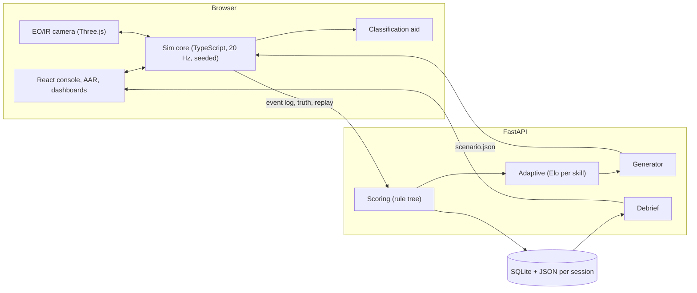

# AEROGUARD

**A counter-drone decision trainer for PS 26247 (Ministry of Defence / DSSC Wellington):
AI Drone & Counter-Drone Threat Simulation Trainer.**

AEROGUARD puts the trainee where a real counter-drone operator sits. It is a
command-and-control console fed by noisy radar, RF, acoustic and EO/IR sensors,
with a panel of Indian effectors (D4 jammer, spoofer and laser, Bhargavastra,
L-70, ZU-23, Shilka). Every drone walks the trainee through the kill chain:
**detect → classify → decide → engage**.

Every decision is scored by an instructor-editable rule tree and replayed in an
after-action review. A debrief explains it in plain language. An adaptive engine
then builds the next mission around the trainee's weakest skill.

It runs in a browser on an ordinary laptop, offline. It is a **decision
trainer, not a shooting game**: there is no aiming skill, only choices.



The design, workflow and roadmap are in **[PLAN.md](PLAN.md)**; section
numbers below refer to it.

---

## Quick start

You need Python 3.11+ and Node 22.18+ (for its built-in TypeScript support).

```bash
./scripts/start.sh          # first run installs everything, builds, seeds demo data
# open http://127.0.0.1:8000
```

`start.sh` also seeds a clearly labelled **synthetic** demo course, so the
dashboards have data. This is six simulated trainees who flew 10 sessions
each through the real loop.

To try it:

1. Create a trainee on the Trainees page.
2. Start with the familiarisation mission, or go straight to the flagship
   *Night autonomous swarm on a forward airbase*.

| | |
|---|---|
| Development (hot reload) | `./scripts/dev.sh` then http://127.0.0.1:5173 |
| All tests | `npm run typecheck && npm run test:sim && .venv/bin/python -m pytest -q tests` |
| End-to-end browser playthrough | `BASE=http://127.0.0.1:8000 CHROMIUM=/path/to/chromium npm run e2e -- familiarisation` |
| Re-seed demo data | `.venv/bin/python scripts/seed_demo.py --reset` |
| Retrain the classification aid | `.venv/bin/python scripts/train_aid.py` (needs `requirements-dev.txt`) |
| Optional LLM debrief | set `GROQ_API_KEY` (and optionally `AEROGUARD_LLM_MODEL`); without it a deterministic template debrief is used |

## Console keys

Press <kbd>?</kbd> in a mission for the full list.

| Key | Action |
|---|---|
| <kbd>N</kbd> / <kbd>Tab</kbd> | next new track |
| click | hook a track |
| <kbd>C</kbd> | cue the camera to the selected track |
| <kbd>T</kbd> | switch EO / IR |
| <kbd>+</kbd> <kbd>−</kbd> | zoom |
| <kbd>V</kbd> or click in the camera | lock the turret (laser rangefinder) |
| <kbd>1</kbd>–<kbd>7</kbd> | classify (bird, friendly, civil, recon, FPV, loitering munition, decoy) |
| <kbd>M</kbd> / <kbd>I</kbd> | monitor / ignore |
| <kbd>A</kbd> | request authority (weapons hold) |
| <kbd>J</kbd> <kbd>G</kbd> <kbd>L</kbd> <kbd>K</kbd> <kbd>X</kbd> <kbd>S</kbd> <kbd>U</kbd> <kbd>Y</kbd> | jammer, GNSS spoof, laser, rockets, missile, SAM, gun, second gun |
| <kbd>Space</kbd> | pause (logged) |

---

## How it answers the problem statement

| PS asks for | AEROGUARD | Where |
|---|---|---|
| Desktop/VR simulator, minimal hardware | Browser app. The sim core is a deterministic 20 Hz TypeScript world that runs in the browser and in Node. The 2D tactical display and a Three.js EO/IR camera run on an integrated GPU. | `sim/`, `web/` |
| Scripted scenarios | 4 hand-written missions in YAML, with a `randomise:` block so even scripted missions vary | `content/missions/` |
| Procedurally generated scenarios | Seeded generator: terrain, time, weather, ROE, sensor failures, threat mix, tactics, clutter. The same seed always gives the same mission (tested). | `server/generator.py` |
| Decision-tree scoring | YAML rule tree scoring every kill-chain step. All six PS examples are rules. Every point cites a rule id and a message. Instructors edit and preview it in the UI. | `content/scoring/rules.yaml`, `server/scoring.py` |
| AAR dashboard | Report card, replay with ground-truth toggle and **hesitation bands**, a decision path per track, debrief, trends per trainee and per unit | `web/src/pages/AAR.tsx`, `Trainee.tsx`, `Unit.tsx` |
| Adaptive difficulty and randomisation | Elo rating per skill (S1–S8). The next mission targets the weakest skill at about 70% predicted success. Fingerprinting prevents near-repeats. | `server/adaptive.py` |

The PS's own scoring examples, as implemented:

| PS example | Rule |
|---|---|
| Detected in 4 s → full points; 15 s → partial; missed → zero | `detect:` config |
| Called a bird a drone → small penalty | `classify.penalty.bird` |
| Called an FPV kamikaze a bird → big penalty | `classify.penalty.fpv` |
| Used a ₹-crore missile on a ₹20,000 quadcopter → penalty | `POOR_COST_EXCHANGE` |
| Jammed a fiber-optic or autonomous drone → wasted action | `JAM_UNJAMMABLE` |
| Shot at a friendly drone → critical failure | `FRATRICIDE` (caps the grade at F) |

## Where the AI is

| Component | What it does | Honest numbers |
|---|---|---|
| Enemy swarm behaviour | Boids steering inside groups, plus tactic templates: split-and-flank, decoys-first, time-on-target, terrain-masked, recon-then-strike. Strikes fly on stale coordinates if their recon was killed early. | Different every seed; the bot suite checks each tactic shows up |
| Adaptive difficulty | Per-skill Elo, weakness-weighted focus sampling, difficulty level solved for 70% predicted success | 70% target checked in tests |
| Realistic sensors | Radar Pd falls with range and RCS (R⁴). The MTI filter drops hovering drones; birds become tracks; terrain masks low flyers. RF hears only emitters. Acoustic is noise-limited. EO goes blind at night. | Each weakness has a unit test |
| Classification aid | Calibrated multinomial logistic regression over sensor features only (never truth). Gives 2 reasons per suggestion. "Unreliable" mode tests automation bias. | 242k samples / 160 synthetic missions. Balanced accuracy **0.92**, ECE **0.002**. Weak pair: loitering munition vs decoy (recall 0.67 / 0.83). |
| AI debrief | Facts computed first. An optional LLM rewrites them; a validator rejects any number or track id not in the facts. The template is always available offline. | Validator tested with a mock LLM that lies |

The PS's example debrief line, *"3 of 5 losses came from the north-east blind
spot"*, is generated from the data: *"2 of 4 leakers came from the east, where
your camera spent only 0% of the mission looking."*

## Screenshots

| | |
|---|---|
|  Trainee home: adaptive, benchmark and scripted missions |  Briefing: situation, intel, ROE, effector costs |
|  IR camera locked on a loitering munition at night (EO is blind) |  After-action review: report card and debrief |
|  Replay and the decision path per track |  Trainee trends: the benchmark line is the evidence of learning |
|  Unit dashboard: trainee × skill heatmap |  Instructor: edit rules, preview the re-score, issue a unit drill |

The trends, unit and AAR screenshots show the **synthetic** demo course. It
is labelled synthetic everywhere in the UI and is not evidence about real
trainees (PLAN.md 11).

---

## Architecture



- **Contracts** (`server/contracts.py`) are the single source of truth.
  `scripts/gen_contracts.py` exports them to JSON Schema and generates
  `sim/src/contracts.ts`. A test fails if the generated files are stale.
- **Ground truth never reaches the C2 display.** The UI renders `sim.view()`,
  built only from tracks. The camera renders truth as pixels, like a real
  camera.
- **Scoring is deterministic and not ML.** Re-scoring the same log with the
  same rules gives the same report. Old scores keep their rules version.
- **Replay plays back recorded frames.** It never re-simulates.

```
content/      catalogue (drones, effectors, sensors, effects; sources or "illustrative"),
              missions, scoring rules, trained aid model
schemas/      generated JSON Schema + normalised catalogue
sim/          deterministic simulation core (TS) + vitest tests
bots/         oracle, baselines, synthetic trainee, feature dump (Node)
server/       generator, scoring, adaptive, debrief, store, API (Python)
web/          React app: console, camera, AAR, dashboards, instructor; e2e playthrough
scripts/      start/dev, codegen, seed demo, train aid
tests/        pytest: contracts, generator, scoring + bot regression, API, adaptive, debrief
```

## Verification

| Check | What it covers |
|---|---|
| **22 sim tests** (`npm run test:sim`) | Determinism, each sensor weakness, soft and hard kill, friendlies caught in jam sectors, collateral, camera lock, ROE authority, the aid, no truth in the view |
| **50 server tests** (`pytest`) | Contracts up to date; generator determinism and focus effects; scoring units; and a **bot regression suite** |
| End-to-end browser playthrough | Creates a trainee and flies a whole mission through the production build's UI, then checks the AAR. Familiarisation and the flagship both score A. |

The bot regression suite works like this:

- The **oracle** gets an A on every mission and beats every baseline.
- Each baseline trips the rules it was built to trip:
  - *passive* lets threats leak;
  - *missile-everything* hits cost-exchange, ROE and fratricide rules;
  - *jam-everything* wastes jamming on RF-silent threats;
  - *trigger-happy* shoots birds and breaks ROE.
- The API end-to-end test plays a bot through the full HTTP loop.

## Content and honesty

- **Public, labelled figures only.** D4 ranges (3 km jam, 1–1.25 km laser)
  come from the problem statement and are marked as sourced. Every other
  number in `content/catalogue/` is marked `illustrative`. A test enforces
  this.
- **Generic terrain.** The terrain is procedural, never a real base layout.
- **Synthetic data stays labelled.** Synthetic trainees, units and sessions
  carry a SYNTHETIC banner wherever they appear.

## Known limitations and next steps

- **No real users yet.** A pilot study (PLAN.md 11) is the most important
  next step: 5+ people × 10 sessions, with benchmark B-1 at sessions 1, 5
  and 10.
- **Deviations from PLAN.md:**
  - The sim runs on the main thread rather than a Web Worker. It costs about
    0.07 ms per tick, so this hasn't been needed.
  - The aid is logistic regression rather than gradient-boosted trees, so it
    can run and explain itself in the browser.
- **Fusion and terrain are simplified.** Track association is keyed by
  truth (no mis-association), and terrain is a procedural heightmap.
- **Not yet built, P1 items from PLAN.md 9.3:**
  - oracle-normalised scores in the UI (the oracle exists and runs in tests);
  - PDF export of the report card;
  - live instructor inject during a mission;
  - gamepad slew.
- **Not yet built, P2 items:**
  - WebXR camera view;
  - RL-trained adversary;
  - Hindi UI.
- **LLM debrief not tested against the live API.** It has only been tested
  with a mock transport here, since this sandbox can't reach the Groq API.
